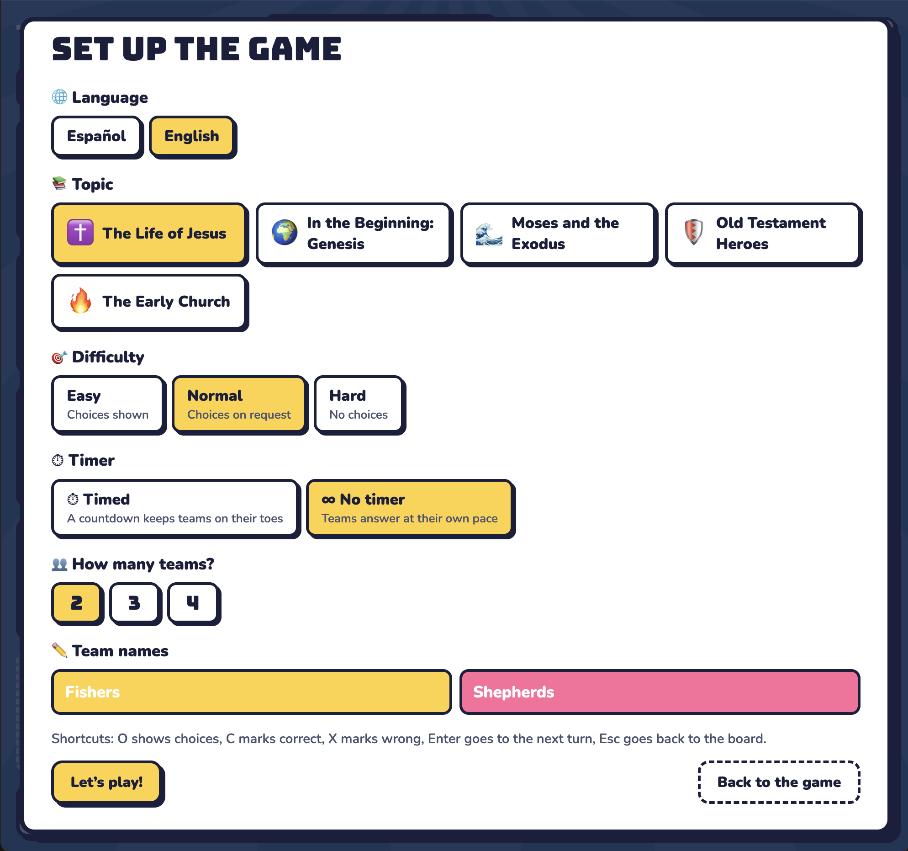
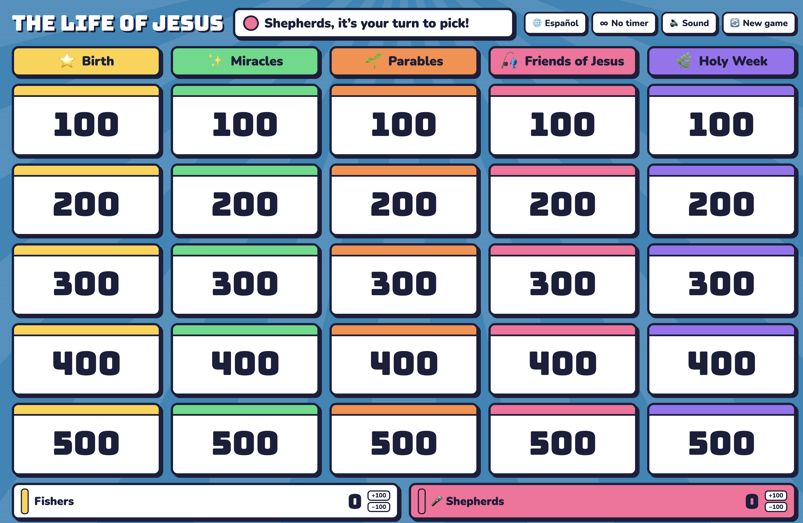
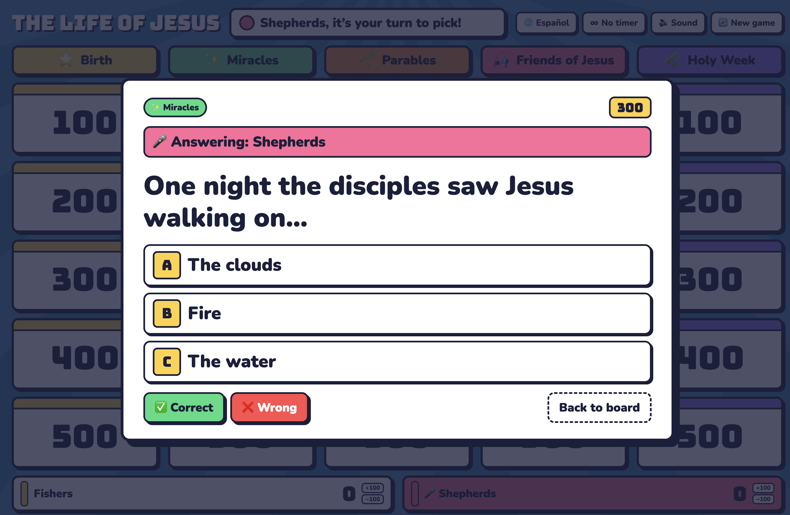

# 🎣 Bible Jeopardy

A Jeopardy-style Bible trivia game for kids (around 5th grade), made for Sunday school and classrooms. Play it on a projector, a laptop or a phone. Available in **English** and **Spanish**.

### Setup / Menú inicial



### Game board / Tablero



### Question with choices / Pregunta con opciones



---

## English

### Features

- **5 topics, 25 questions each:** The Life of Jesus, Genesis, Moses and the Exodus, Old Testament Heroes, The Early Church.
- **Automatic turns:** the game picks who starts and tells each team when it's their turn.
- **Steals:** if a team misses, the next team gets one chance to steal the points.
- **Full net! 🎣:** one hidden tile on each board is worth double.
- **3 difficulty levels:**
  - **Easy:** A/B/C choices shown right away.
  - **Normal:** choices only if the team asks.
  - **Hard:** no choices, kids answer from memory.
- **Optional timer:** play with a countdown or at your own pace. You can switch it on or off mid-game.
- **Auto-save:** the game survives a page refresh, even with a question open.
- **Every answer includes its Bible reference**, so the teacher can check it.
- Works on big screens and phones.

### How to play

1. Choose language, topic, difficulty, timer and number of teams (2–4).
2. The team whose turn it is picks a tile.
3. Read the question aloud. Mark **Correct** or **Wrong**, or tap the choice the team picked.
4. A wrong answer gives the next team a chance to steal.
5. When all 25 tiles are used, the team with the most points wins.

### Keyboard shortcuts

| Key     | Action            |
| ------- | ----------------- |
| `O`     | Show choices      |
| `C`     | Correct           |
| `X`     | Wrong             |
| `Enter` | Next turn         |
| `Esc`   | Back to the board |

Each team has **+100 / −100** buttons to fix the score if needed.

---

## Español

Juego de trivia bíblica estilo Jeopardy para niños de 5º grado aproximadamente, pensado para escuela dominical y salones de clase. Se juega en proyector, computadora o celular, en **español** o **inglés**.

### Qué incluye

- **5 temas con 25 preguntas cada uno:** La vida de Jesús, Génesis, Moisés y el Éxodo, Héroes del Antiguo Testamento y La iglesia primitiva.
- **Turnos automáticos:** el juego sortea quién empieza y avisa a quién le toca.
- **Robo:** si un equipo falla, el siguiente tiene una oportunidad de robar los puntos.
- **¡Red llena! 🎣:** una casilla escondida en cada tablero vale el doble.
- **3 niveles de dificultad:**
  - **Fácil:** las opciones A/B/C aparecen de una vez.
  - **Normal:** las opciones salen solo si las piden.
  - **Difícil:** sin opciones, responden de memoria.
- **Reloj opcional:** se juega con cuenta regresiva o con calma, y se puede cambiar a mitad del juego.
- **Guardado automático:** si recargás la página, el juego sigue donde iba, aunque haya una pregunta abierta.
- **Cada respuesta trae su cita bíblica** para que el maestro la pueda verificar.

### Cómo jugar

1. Elegí idioma, tema, dificultad, reloj y número de equipos (2 a 4).
2. El equipo en turno escoge una casilla.
3. Leé la pregunta en voz alta. Marcá **Correcto** o **Incorrecto**, o tocá la opción que dijo el equipo.
4. Si fallan, el siguiente equipo puede robar.
5. Cuando se usan las 25 casillas, gana el equipo con más puntos.

---

## Adding or editing questions

Everything lives in a single file, `index.html`. Questions are in the `THEMES` array, and each question has this format:

```js
[
  "Spanish question",
  "English question",
  ["Correct ES", "Wrong ES", "Wrong ES"],
  ["Correct EN", "Wrong EN", "Wrong EN"],
  "Libro ES / Book EN 1:1",
  "Optional note ES",
  "Optional note EN",
];
```

**The first option is always the correct one.** The game shuffles the choices on screen.

Each theme needs exactly **5 categories with 5 questions each**, ordered from easiest (100) to hardest (500).

## Notes

- Saved games are stored in the browser (`localStorage`). They don't carry over between devices or browsers, or into private/incognito windows.
- No build step or dependencies. Just open `index.html` or host it on GitHub Pages.

## License

[MIT](LICENSE). Feel free to use, adapt and share it with your church or school.

Made by Oscar Calix.
